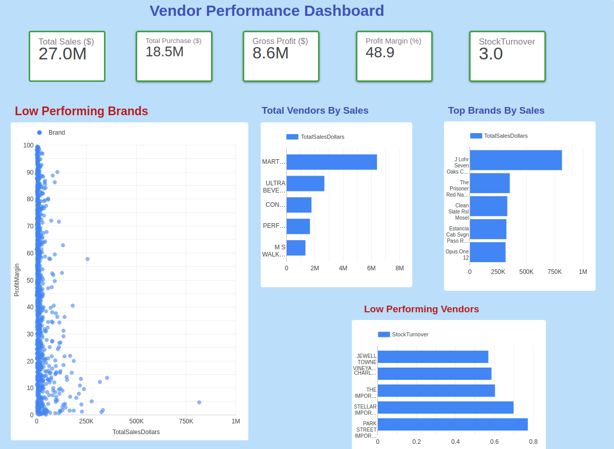

# Vendor-Performance-Analysis

An end-to-end data analytics project utilizing Python for data engineering and transformation, a local SQLite relational environment, and an interactive Google Looker Studio dashboard to track vendor metrics.

## Executive Performance Dashboard

## Data Pipeline Tech Stack
* **Language:** Python 3 (Pandas, SQLAlchemy)
* **Storage Environment:** SQLite Database
* **BI Presentation:** Google Looker Studio
* **Core Metrics Tracked:** Total Sales Volume ($), Net Purchase Contributions, Margin Profiles, Stock Inventory Turnovers

## Key Highlights
* Created an automated ingestion pipeline (`get_vendor_summary.py`) to stream raw transaction logs.
* Mapped out product profit margins versus total sales using scatter plot distributions to isolate low-performing brand clusters.
* Note: Large raw `.csv` and `.db` files are kept locally due to file size constraints.
